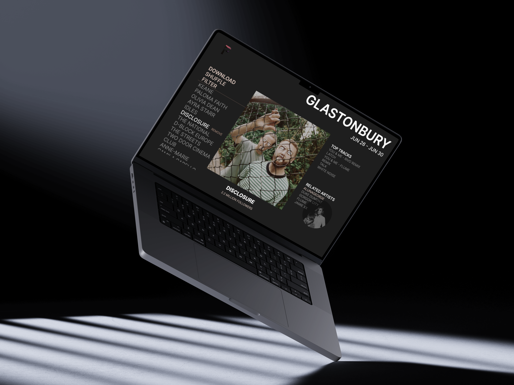

<p align="center">
  
</p>


Festify is a web application where users can explore, listen-to and create playlists from their favourite music festivals.

## Screenshots

<p align="center">
  
</p>


## Getting started

1. Clone the repo

```
git clone https://github.com/jasnwng/festify
cd festify
```

2. Install client dependencies
```
cd client
npm install
```

3. Start client server
```
npm run dev
```

4. Install server dependecies 
```
cd server
npm install
```

5. Start development server
```
node index.js
```

6. Seed the database.


## Built with

* [React] () - Front end JS library for building user interfaces
* [Express] () - Back end web framework for building RESTful APIs with Node.js
* [MongoDB] (https://www.mongodb.com/) - Document based database
* [SpotifyAPI] (https://developer.spotify.com/) - Retrieve metadata from Spotify content, control playback and creating playlists


## Contributing

Improvements are welcome!

Fork the repo and do your thing. Push to your fork and submit a pull request.


## Author

Jason Wong - [Github](https://github.com/jasnwng) - [LinkedIn](https://www.linkedin.com/in/jasnwng/)


## License

This project is licensed under the MIT License.
